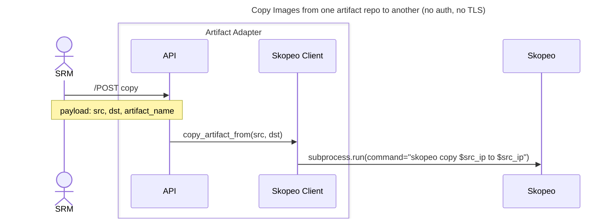

```mermaid
sequenceDiagram
title Copy Images from one artifact repo to another (no auth, no TLS)
actor SRM
box Artifact Adapter
    participant API
    participant SCL as Skopeo Client
end
participant Skopeo

SRM ->> API: /POST copy
note over SRM,API: payload: src, dst, artifact_name

API ->> SCL: copy_artifact_from(src, dst)

SCL ->> Skopeo: subprocess.run(command="skopeo copy $src_ip to $src_ip")
```